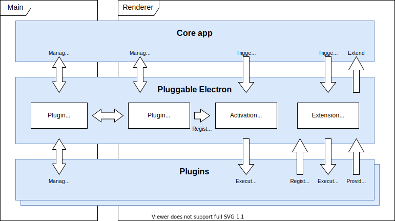

# Pluggable Electron
<!-- PROJECT SHIELDS: See https://github.com/badges/shields -->

<!-- PROJECT LOGO -->

<!-- TABLE OF CONTENTS -->
<!-- TOC depthfrom:2 depthto:2 -->

* [What is Pluggable Electron](#what-is-pluggable-electron)
* [Introduction](#introduction)
* [Getting Started](#getting-started)
* [Usage](#usage)
* [Roadmap](#roadmap)
* [Contributing](#contributing)
* [License](#license)
* [Contact](#contact)

<!-- /TOC -->
## What is Pluggable Electron
**Pluggable Electron is a framework to build Electron apps that can be extended by other parties.** 

### :heavy_exclamation_mark: Notice :heavy_exclamation_mark: 
Note that this project is under active development. The main branch should work so feel free to try it out and [report](https://github.com/dutchigor/pluggable-electron/issues) it if you have any questions of find any issues, but expect breaking changes still at this point.

## Introduction

Pluggable Electron allows an [Electron](https://www.electronjs.org/) app to include extension points in the code. Plugin developers can then write extensions - in the form of npm packages - that can be inserted into these extension points.

The framework includes the tools necessary to manage the whole life cycle of plugins, for example writing, installing, uninstalling and updating plugins, and creating and triggering extension points.

The framework uses [inversion of control](https://en.wikipedia.org/wiki/Inversion_of_control) and [dependency inversion](https://en.wikipedia.org/wiki/Dependency_inversion_principle) principles for this.



## Getting Started

To include Pluggable Electron, follow these simple steps:

### Prerequisites

This package should be installed inside an Electron project. Please [create that first](https://www.electronjs.org/docs/tutorial/quick-start).

### Installation

Add Pluggable Electron in your project as a dependency to your project
```sh
npm install pluggable-electron
```

## Usage

The framework is built around the concepts of Extension points and Plugins

### Extension points
Extension points are added to your [renderer](https://www.electronjs.org/docs/tutorial/quick-start#application-architecture) code. Start by adding extension points to the renderer process.

```javascript
// renderer.js
const pe = require( "pluggable-electron" )

// Initiate Pluggable Electron using Plugins Facade
pe.init( true )

// Create extension point
pe.extensionPoints.add( 'purchase_menu' )
```
Then execute this extension point where you want to extend your code. This can be done as a handover, parallel execution, or serial execution. These options are explained [here](wiki/home#DefiningandTriggeringExtensionPoints).
```javascript
// your-module.js
const pe = require( "pluggable-electron" )

// ... Your business logic ...
const extendMenu = await pe.extensionPoints.execute('purchase_menu', purchaseMenu )
// extendMenu will contain the result of any extensions registered to purchase_menu
```

### Creating plugins
A plugin is an npm package with activation points added to the package.json.
```json
// package.json
{
   ...
   "main": "index.js",
   "activationPoints": [
      "init"
   ]
   ...
}
```
The main file of this plugin should include a function by the name of the activation point. This function will be be triggered by the activation point with the list of available extension points (as created above) as a parameter. Extensions can be registered to the extension points using this list. An extension can be a callback or object returned to the register method.
```javascript
// index.js
module.exports.init = extensionPoints => {
   // Mock function for adding a menu item
   const yourCustomExtension = varFromEp => {
      // your extension code here.
      // VarFromEp is provided as a parameter when the extension point is executed
   }

  // Register to purchase_menu extension point
  extensionPoints.purchase_menu.register( 'extension-name', yourCustomExtension )
}
```

### Installing plugins
Plugins can be installed from the main process or the renderer. In this setup we will use the renderer. This still requires initialising the plugin facade in the main process. Doing everything from the main process is described in the [API documentation](wiki/main-API).

Once installed, he plugins should be loaded on every startup.

```javascript
// main.js
const pe = require( 'pluggable-electron' )

app.whenReady().then( () => {
   // Enable the plugin facade connection
   pe.init( true )

   // Create browser window...
})
```
```javascript
//  renderer.js
const pe = require( '../pluggable-electron' )

// Get plugins that have been loaded in the main process
// and register them with their activation points
pe.plugins.getActive()
  .then( plugins => plugins.forEach( plugin => plugin.register() ) )

// Get plugin file from input, install and register
document.getElementById( 'install-file-input' ).addEventListener( 'change', e =>
   pe.plugins.install( e.target.files[0].path )
      .then( plugin => plugin.register() )
)
```

### Activating plugins
Executing the activation functions in the plugins is done by triggering their activation point. There can be different strategies for activating the plugin, like:
* Activating all plugins during startup - one point during the app startup for synchronous extensions and one after startup for async extensions
* Activating the relevant plugins just before an extension point is triggered.

```javascript
// renderer.js
// insert any point the extensions have been added and plugins have been registered
pe.activation.trigger( 'init' )
// but before related extension points are triggered.
```
Now the `yourCustomExtension` function in the plugin will be executed when the execution point `purchase_menu` is triggered.

### Further functionality
Pluggable Electron provides a host of functions to support the full plugin lifecycle and some alternative workflows. A more detailed description of the full lifecycle, as well as a detailed API documentation can be found in the [wiki](wiki).

## Roadmap

See the [open issues](https://github.com/dutchigor/pluggable-electron/issues) for a list of proposed features (and known issues).

## Contributing

Contributions are what make the open-source community such an amazing place to be, learn, inspire, and create. Any contributions you make are **greatly appreciated**.

1. Fork the Project
2. Create your Feature Branch (`git checkout -b feature/AmazingFeature`)
3. Commit your Changes (`git commit -m 'Add some AmazingFeature'`)
4. Push to the Branch (`git push origin feature/AmazingFeature`)
5. Open a Pull Request

## License

Distributed under the MIT License. See `LICENSE` for more information.

## Contact

This project is maintained by Igor Honhoff. Feel free to contact me at igor@flarehub.io
Project Link: [https://github.com/dutchigor/pluggable-electron](https://github.com/dutchigor/pluggable-electron)

<!-- ACKNOWLEDGEMENTS -->
